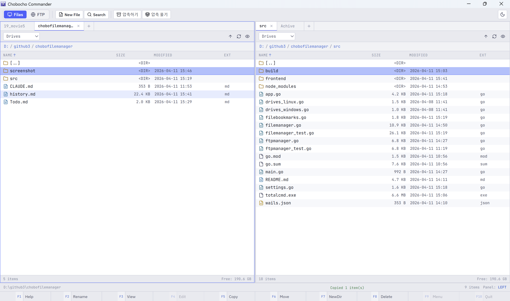

# Chobocho Commander

**Wails v2** (Go + React)로 만든 이중 패널 파일 관리자 (Total Commander Clone)



---

## 주요 기능

### 파일 관리자
- 이중 패널 레이아웃 (좌 / 우)
- 키보드 네비게이션 (방향키, Enter, Backspace, Insert)
- 복사 (F5), 이동 (F6), 삭제 (F8)
- 새 디렉토리 (F7), 새 파일, 이름 변경 (F2)
- 다중 선택 (Ctrl+Click, Shift+Click, Insert, Ctrl+A)
- 파일 검색 (재귀 탐색)
- 숨김 파일 토글 (Ctrl+H)
- 내장 텍스트 에디터 (.txt, .go, .js, .py 등)
- ZIP 압축 / 압축 해제
- 경로 표시줄 (클릭 가능한 브레드크럼)
- 드라이브 / 마운트 포인트 선택기
- 네비게이션 히스토리 (뒤로 / 앞으로)
- 경로 직접 편집

### FTP 클라이언트
- FTP 서버 연결
- 북마크 관리 (`~/.chobocho-commander/ftp_bookmarks.json`에 저장)
- 파일 다운로드 (원격 → 로컬)
- 파일 업로드 (로컬 → 원격)
- 원격 파일 / 디렉토리 삭제
- 원격 디렉토리 생성
- 원격 항목 이름 변경
- 패시브 모드 지원

### UI
- 다크 테마 + JetBrains Mono 폰트
- F-key 단축키 바 (Total Commander 클래식 스타일)
- 하단 상태 바 (파일 수, 선택 정보)
- 모달 및 전환 애니메이션

---

## 개발 환경 요구사항

| 도구 | 버전 |
|------|------|
| Go | 1.22+ |
| Node.js | 18+ |
| Wails CLI | v2.9+ |

### Wails CLI 설치
```bash
go install github.com/wailsapp/wails/v2/cmd/wails@latest
```

### 플랫폼별 의존성
- **Windows**: WebView2 런타임 (Windows 10/11에 기본 포함)
- **Linux**: `webkit2gtk-4.0`, `gtk3`, `pkg-config`

```bash
# Ubuntu/Debian
sudo apt install libwebkit2gtk-4.0-dev libgtk-3-dev pkg-config

# Fedora
sudo dnf install webkit2gtk4.0-devel gtk3-devel
```

---

## 개발 실행

```bash
cd src

# 개발 모드 실행 (핫 리로드)
wails dev
```

---

## 빌드

```bash
# Windows x64
wails build -platform windows/amd64

# Linux x64
wails build -platform linux/amd64
```

빌드 결과물: `./build/bin/`

---

## 키보드 단축키

| 키 | 동작 |
|----|------|
| `↑` / `↓` | 파일 탐색 |
| `Enter` | 열기 / 디렉토리 진입 |
| `Backspace` | 상위 디렉토리 이동 |
| `Space` | 선택 토글 |
| `Insert` | 선택 토글 + 이동 |
| `Ctrl+A` | 전체 선택 |
| `Ctrl+H` | 숨김 파일 토글 |
| `Ctrl+R` | 새로 고침 |
| `F2` | 이름 변경 |
| `F5` | 반대 패널로 복사 |
| `F6` | 반대 패널로 이동 |
| `F7` | 새 디렉토리 생성 |
| `F8` / `Del` | 삭제 |
| `Ctrl+S` | 저장 (에디터) |
| `Esc` | 모달 / 에디터 닫기 |

---

## 프로젝트 구조

```
src/
├── main.go              # Wails 앱 진입점
├── app.go               # Go-JS API 브리지 (25개+ 메서드)
├── filemanager.go       # 파일 작업 핵심 구현
├── ftpmanager.go        # FTP 클라이언트 구현
├── drives_windows.go    # Windows 드라이브 감지
├── drives_linux.go      # Linux 마운트 포인트 감지
├── go.mod               # Go 모듈 의존성
├── wails.json           # Wails 설정
└── frontend/
    ├── index.html
    ├── package.json
    ├── vite.config.js
    └── src/
        ├── App.jsx               # 최상위 컴포넌트
        ├── main.jsx              # React 진입점
        ├── stores/
        │   ├── fileStore.js      # Zustand 파일 관리 상태
        │   └── ftpStore.js       # Zustand FTP 상태
        ├── components/
        │   ├── FilePanel.jsx     # 이중 패널 파일 브라우저
        │   ├── Toolbar.jsx       # 상단 툴바 + F-key 버튼
        │   ├── StatusBar.jsx     # 하단 상태 바
        │   ├── FTPManager.jsx    # FTP 클라이언트 UI
        │   ├── TextEditor.jsx    # 내장 텍스트 에디터
        │   └── ConfirmDialog.jsx # 모달 대화상자
        └── styles/
            ├── global.css
            ├── App.module.css
            ├── FilePanel.module.css
            ├── Toolbar.module.css
            ├── StatusBar.module.css
            ├── FTPManager.module.css
            ├── TextEditor.module.css
            └── Dialogs.module.css
```

---

## 기술 스택

| 분류 | 기술 | 버전 |
|------|------|------|
| 백엔드 | Go | 1.22 |
| 데스크톱 프레임워크 | Wails | v2.11 |
| FTP 라이브러리 | jlaffaye/ftp | v0.2.0 |
| UI 라이브러리 | React | 18 |
| 상태 관리 | Zustand | v4 |
| 빌드 도구 | Vite | v4 |
| 아이콘 | lucide-react | v0.383 |

---

## 설정 파일

FTP 북마크는 `~/.chobocho-commander/ftp_bookmarks.json`에 자동 저장됩니다.
